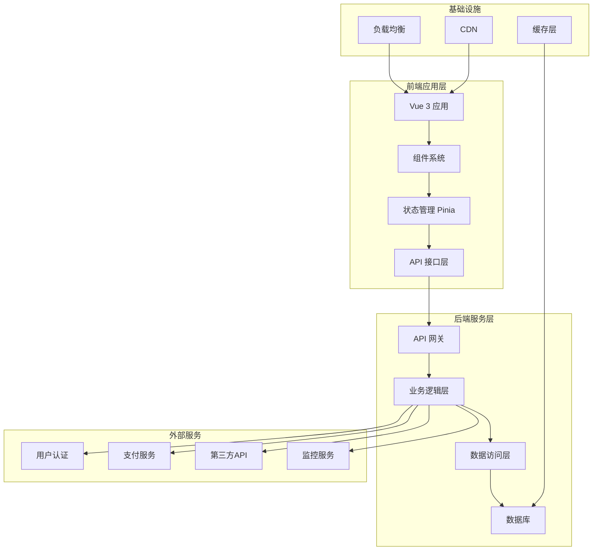
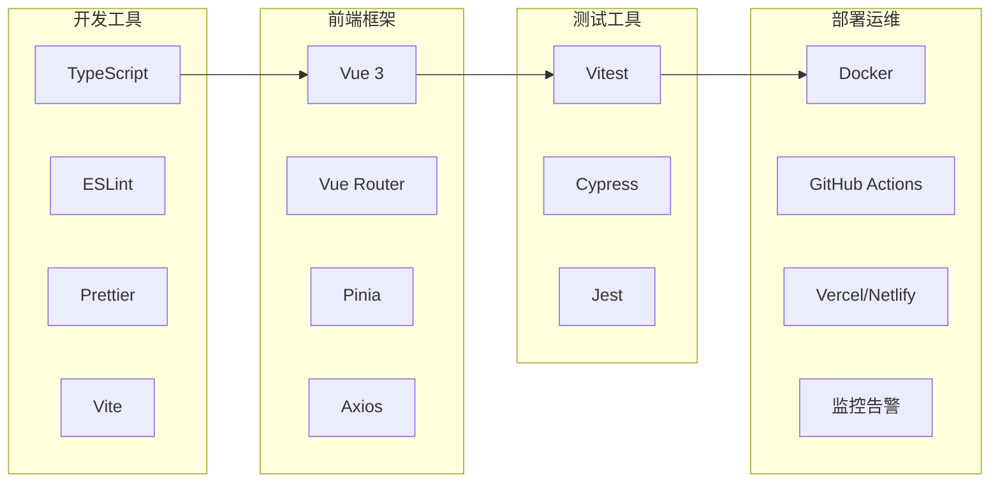
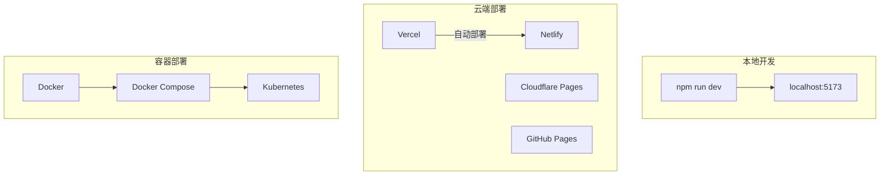
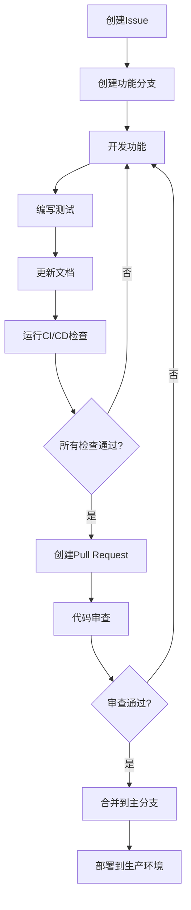

<div align="center"><a name="readme-top"></a>

# 🛍️ 抖音商城前端<br/><h3>基于Vue 3 + TypeScript的现代电商平台</h3>

一个功能完整的现代化电商前端应用，采用Vue 3 + TypeScript技术栈。<br/>
支持商品浏览、购物车管理、订单处理、在线支付等完整购物流程。<br/>
提供响应式设计，支持多种支付方式，**免费**开源项目。

[在线演示][demo-link] · [更新日志][changelog] · [开发文档][docs] · [问题反馈][github-issues-link]

<br/>

[][demo-link]

<br/>

<!-- SHIELD GROUP -->

[![][github-release-shield]][github-release-link]
[![][github-stars-shield]][github-stars-link]
[![][github-forks-shield]][github-forks-link]
[![][github-issues-shield]][github-issues-link]
[![][github-license-shield]][github-license-link]

**分享项目**

[![][share-x-shield]][share-x-link]
[![][share-telegram-shield]][share-telegram-link]
[![][share-whatsapp-shield]][share-whatsapp-link]
[![][share-reddit-shield]][share-reddit-link]
[![][share-weibo-shield]][share-weibo-link]

<sup>🌟 构建下一代电商购物体验。为现代用户和开发者而生。</sup>

## 📸 项目截图

> [!TIP]
> 以下截图展示了项目的核心功能和用户界面。

<div align="center">
  
  <p><em>商城首页 - 商品列表展示</em></p>
</div>

<div align="center">
  
  
  <p><em>商品详情页面和购物车管理</em></p>
</div>

<details>
<summary><kbd>📱 更多截图</kbd></summary>

<div align="center">
  
  <p><em>移动端响应式设计</em></p>
</div>

<div align="center">
  
  <p><em>支付页面 - 支持多种支付方式</em></p>
</div>

</details>

**技术栈徽章:**

<div align="center">

 
 
 
 
 

</div>

</div>

> [!IMPORTANT]
> 本项目展示了现代Vue 3前端开发的最佳实践。结合TypeScript类型安全、Vite快速构建、Pinia状态管理，提供完整的电商购物体验。功能包括用户认证、商品管理、购物车、订单处理和多种支付方式。

<details>
<summary><kbd>📑 目录</kbd></summary>

#### 目录

- [🛍️ 抖音商城前端基于Vue 3 + TypeScript的现代电商平台](#️-抖音商城前端基于vue-3--typescript的现代电商平台)
  - [📸 项目截图](#-项目截图)
      - [目录](#目录)
      - [](#)
  - [🌟 项目介绍](#-项目介绍)
  - [✨ 核心功能](#-核心功能)
    - [`1` 商品管理系统](#1-商品管理系统)
    - [`2` 购物车与订单](#2-购物车与订单)
    - [`*` 其他功能](#-其他功能)
  - [🛠️ 技术栈](#️-技术栈)
  - [🏗️ 项目架构](#️-项目架构)
    - [系统架构](#系统架构)
    - [技术架构](#技术架构)
    - [组件结构](#组件结构)
  - [🚀 快速开始](#-快速开始)
    - [环境要求](#环境要求)
    - [快速安装](#快速安装)
    - [环境配置](#环境配置)
    - [开发模式](#开发模式)
  - [🛳 部署指南](#-部署指南)
    - [`A` 云端部署](#a-云端部署)
    - [`B` Docker部署](#b-docker部署)
    - [`C` 环境变量](#c-环境变量)
  - [📖 使用指南](#-使用指南)
    - [基础使用](#基础使用)
      - [用户界面导览](#用户界面导览)
    - [高级配置](#高级配置)
    - [API接口](#api接口)
  - [⌨️ 开发指南](#️-开发指南)
    - [本地开发](#本地开发)
    - [添加功能](#添加功能)
    - [测试](#测试)
  - [🤝 贡献指南](#-贡献指南)
    - [开发流程](#开发流程)
    - [贡献规范](#贡献规范)
  - [📄 开源协议](#-开源协议)
  - [👥 项目团队](#-项目团队)
  - [🙋‍♀️ 作者信息](#️-作者信息)

####

<br/>

</details>

## 🌟 项目介绍

我们致力于创建下一代电商购物平台前端解决方案。通过采用现代Web开发技术和最佳实践，为用户提供流畅、安全、功能丰富的购物体验。

无论您是终端用户还是专业开发者，这个项目都将成为您探索现代电商前端开发的绝佳起点。请注意，项目正在积极开发中，欢迎反馈任何[问题][issues-link]。

> [!NOTE]
> - Node.js >= 18.0.0 必需
> - 后端API服务必需
> - 支持现代浏览器

| [![][demo-shield-badge]][demo-link]   | 无需安装！访问我们的在线演示体验完整功能。                           |
| :------------------------------------ | :------------------------------------------------------------------- |
| [![][discord-shield-badge]][discord-link] | 加入我们的社区！与开发者和用户交流。 |

> [!TIP]
> **⭐ 给我们点个星** 从GitHub接收所有版本更新通知！

[![][image-star]][github-stars-link]

## ✨ 核心功能

### `1` [商品管理系统][docs-feat-product]

体验下一代商品展示系统。我们的创新设计提供了无与伦比的商品浏览体验，通过先进的前端技术实现流畅的交互。这一突破性功能提供了卓越的用户体验。

<div align="center">
  
  <p><em>商品列表页面功能演示</em></p>
</div>

核心能力包括:
- 🚀 **高性能加载**: 优化的图片懒加载和虚拟滚动
- 🔧 **智能筛选**: 多维度商品筛选和搜索
- 📱 **响应式设计**: 完美适配各种设备尺寸
- 🛡️ **数据安全**: TypeScript类型安全保证

[![][back-to-top]](#readme-top)

### `2` [购物车与订单][docs-feat-cart]

革命性的购物车管理系统，改变用户与电商平台的交互方式。通过我们先进的状态管理和直观的设计，用户可以轻松管理购物车，同时保持最高的性能标准。

<div align="center">
  
  
  <p><em>购物车管理（左）和订单处理（右）</em></p>
</div>

**可用功能:**
- **实时更新**: 购物车状态实时同步
- **智能计算**: 自动计算总价和优惠

[![][back-to-top]](#readme-top)

### `*` 其他功能

除了核心功能外，本项目还包括:

- [x] 💨 **快速部署**: 一键部署到各大云平台
- [x] 🌐 **国际化支持**: 多语言界面支持
- [x] 🔒 **安全优先**: JWT认证和数据加密
- [x] 💎 **现代UI/UX**: 精美的界面设计和暗色主题
- [x] 🗣️ **实时通信**: WebSocket支持实时通知
- [x] 📊 **数据分析**: 内置用户行为分析
- [x] 🔌 **高度可扩展**: 模块化架构易于扩展
- [x] 📱 **PWA支持**: 渐进式Web应用功能

> ✨ 更多功能正在不断开发中。

<div align="right">

[![][back-to-top]](#readme-top)

</div>

## 🛠️ 技术栈

<div align="center">
  <table>
    <tr>
      <td align="center" width="96">
        
        <br>Vue 3
      </td>
      <td align="center" width="96">
        
        <br>TypeScript 5
      </td>
      <td align="center" width="96">
        
        <br>Vite 6
      </td>
      <td align="center" width="96">
        
        <br>Pinia
      </td>
      <td align="center" width="96">
        
        <br>Axios
      </td>
      <td align="center" width="96">
        
        <br>Vitest
      </td>
      <td align="center" width="96">
        
        <br>Cypress
      </td>
    </tr>
  </table>
</div>

**前端技术栈:**
- **框架**: Vue 3 + Composition API
- **语言**: TypeScript 5 实现类型安全
- **构建工具**: Vite 6 极速构建和热更新
- **状态管理**: Pinia 现代化状态管理
- **路由**: Vue Router 4 单页应用路由

**开发工具:**
- **HTTP客户端**: Axios 网络请求
- **样式方案**: CSS3 + 响应式设计
- **代码规范**: ESLint + Prettier
- **测试框架**: Vitest (单元测试) + Cypress (E2E测试)

**部署与监控:**
- **部署平台**: Vercel / Netlify / 自托管
- **CI/CD**: GitHub Actions
- **监控**: 性能监控和错误追踪
- **测试**: 自动化测试流水线

> [!TIP]
> 每项技术都经过精心选择，确保生产环境的稳定性、开发体验和长期可维护性。

## 🏗️ 项目架构

### 系统架构

> [!TIP]
> 该架构支持水平扩展和微服务模式，适用于企业级应用的生产环境。



### 技术架构



### 组件结构

```
src/
├── App.vue                 # 根组件
├── main.ts                 # 应用入口
├── components/             # 可复用组件
│   ├── layout/            # 布局组件
│   │   ├── TheHeader.vue  # 头部导航
│   │   └── TheFooter.vue  # 底部信息
│   ├── PaymentPage.vue    # 支付页面
│   └── icons/             # 图标组件
├── views/                 # 页面组件
│   ├── ProductList.vue    # 商品列表
│   ├── ProductDetail.vue  # 商品详情
│   ├── CartView.vue       # 购物车
│   ├── OrdersView.vue     # 订单管理
│   └── LoginView.vue      # 用户登录
├── stores/                # Pinia状态管理
│   ├── cartStore.ts       # 购物车状态
│   ├── userStore.ts       # 用户状态
│   └── productStore.ts    # 商品状态
├── services/              # API服务层
│   ├── productService.ts  # 商品API
│   ├── cartService.ts     # 购物车API
│   ├── orderService.ts    # 订单API
│   └── paymentService.ts  # 支付API
├── types/                 # TypeScript类型定义
│   ├── index.ts          # 通用类型
│   ├── cart.ts           # 购物车类型
│   ├── order.ts          # 订单类型
│   └── payment.ts        # 支付类型
├── router/               # 路由配置
│   └── index.ts          # 路由定义
└── styles/               # 全局样式
    └── main.css          # 主样式文件
```

## 🚀 快速开始

### 环境要求

> [!IMPORTANT]
> 请确保已安装以下软件:

- Node.js 18.0+ ([下载](https://nodejs.org/))
- npm/yarn/pnpm 包管理器
- Git ([下载](https://git-scm.com/))
- [可选] Docker 用于容器化开发

### 快速安装

**1. 克隆仓库**

```bash
git clone https://github.com/ChanMeng666/douyin-mall-frontend.git
cd douyin-mall-frontend
```

**2. 安装依赖**

```bash
# 使用 npm
npm install

# 使用 yarn
yarn install

# 使用 pnpm (推荐)
pnpm install
```

**3. 环境配置**

```bash
# 复制环境变量模板
cp .env.example .env.local

# 编辑环境变量
nano .env.local
```

**4. 启动开发服务器**

```bash
npm run dev
```

🎉 **成功!** 打开 [http://localhost:5173](http://localhost:5173) 查看应用。

### 环境配置

创建 `.env.local` 文件并配置以下环境变量:

```bash
# API服务地址
VITE_API_BASE_URL=http://localhost:8080/api

# 应用配置
VITE_APP_TITLE=抖音商城
VITE_APP_VERSION=1.0.0

# 第三方服务 (可选)
VITE_ANALYTICS_ID=your-analytics-id
VITE_SENTRY_DSN=your-sentry-dsn
```

> [!TIP]
> 使用 `openssl rand -base64 32` 生成安全的随机密钥。

### 开发模式

```bash
# 启动开发服务器
npm run dev

# 运行测试
npm run test:unit

# 运行E2E测试
npm run test:e2e:dev

# 代码检查
npm run lint

# 类型检查
npm run type-check

# 生产构建
npm run build
```

## 🛳 部署指南

> [!IMPORTANT]
> 选择最适合您需求的部署策略。推荐使用云端部署用于生产环境。



### `A` 云端部署

**Vercel (推荐)**

[](https://vercel.com/new/clone?repository-url=https%3A%2F%2Fgithub.com%2FChanMeng666%2Fdouyin-mall-frontend)

**手动部署:**

```bash
# 安装 Vercel CLI
npm i -g vercel

# 部署
vercel --prod
```

**其他平台:**

<div align="center">

|           Netlify部署            |                     Railway部署                      |                     Render部署                      |
| :-------------------------------------: | :---------------------------------------------------------: | :---------------------------------------------------------: |
| [![][deploy-netlify-button]][deploy-netlify-link] | [![][deploy-railway-button]][deploy-railway-link] | [![][deploy-render-button]][deploy-render-link] |

</div>

### `B` Docker部署

```bash
# 构建 Docker 镜像
docker build -t douyin-mall-frontend .

# 运行容器
docker run -p 3000:3000 douyin-mall-frontend

# 或使用 Docker Compose
docker-compose up -d
```

**docker-compose.yml:**

```yaml
version: '3.8'
services:
  frontend:
    build: .
    ports:
      - "3000:3000"
    environment:
      - VITE_API_BASE_URL=${API_BASE_URL}
    depends_on:
      - backend
  
  backend:
    image: douyin-mall-backend:latest
    ports:
      - "8080:8080"
    environment:
      - DATABASE_URL=${DATABASE_URL}

volumes:
  app_data:
```

### `C` 环境变量

> [!WARNING]
> 切勿将敏感环境变量提交到版本控制。生产环境请使用安全的密钥管理服务。

| 变量名 | 描述 | 必需 | 默认值 | 示例 |
|----------|-------------|----------|---------|---------|
| `VITE_API_BASE_URL` | 后端API地址 | ✅ | - | `http://localhost:8080/api` |
| `VITE_APP_TITLE` | 应用标题 | 🔶 | `抖音商城` | `我的商城` |
| `VITE_ANALYTICS_ID` | 分析服务ID | 🔶 | - | `GA_MEASUREMENT_ID` |
| `VITE_SENTRY_DSN` | 错误监控DSN | 🔶 | - | `https://xxx@sentry.io/xxx` |

> [!NOTE]
> ✅ 必需, 🔶 可选

## 📖 使用指南

### 基础使用

**开始使用:**

1. **访问应用** 打开浏览器访问应用地址
2. **浏览商品** 在首页查看商品列表
3. **添加到购物车** 选择心仪商品加入购物车
4. **下单支付** 完成订单创建和支付流程

#### 用户界面导览

<div align="center">
  
  <p><em>应用首页 - 商品展示</em></p>
</div>

**快速操作:**

```javascript
// 添加商品到购物车
const addToCart = async (productId, quantity) => {
  await cartService.addToCart({ 
    product_id: productId, 
    quantity 
  });
};

// 获取用户订单
const getOrders = async () => {
  const response = await orderService.getOrders();
  return response.data;
};
```

### 高级配置

**自定义配置:**

```typescript
// config/app.config.ts
export const appConfig = {
  features: {
    enableAnalytics: true,
    enableNotifications: true,
    enableBetaFeatures: false,
  },
  limits: {
    maxCartItems: 50,
    maxFileSize: '10MB',
    sessionTimeout: 30 * 60 * 1000, // 30分钟
  },
  payment: {
    supportedMethods: ['alipay', 'wechat', 'credit-card'],
    timeout: 15 * 60 * 1000, // 15分钟
  },
};
```

### API接口

> [!TIP]
> 所有API端点支持JSON格式，需要适当的认证头信息。

**认证:**

```bash
# 用户登录
POST /api/user/login
Content-Type: application/json

{
  "email": "user@example.com",
  "password": "password"
}

# 响应
{
  "code": "0000",
  "info": "登录成功",
  "data": {
    "token": "eyJhbGciOiJIUzI1NiIsInR5cCI6IkpXVCJ9...",
    "user": {
      "id": "123",
      "email": "user@example.com"
    }
  }
}
```

**核心端点:**

| 方法 | 端点 | 描述 | 需要认证 |
|--------|----------|-------------|---------------|
| `GET` | `/api/product/list` | 获取商品列表 | ❌ |
| `GET` | `/api/product/get` | 获取商品详情 | ❌ |
| `GET` | `/api/cart/get` | 获取购物车 | ✅ |
| `POST` | `/api/cart/add` | 添加到购物车 | ✅ |
| `POST` | `/api/order/create` | 创建订单 | ✅ |
| `POST` | `/api/payment/pay` | 发起支付 | ✅ |

**使用示例:**

```javascript
// 使用 fetch API
const response = await fetch('/api/product/list', {
  method: 'GET',
  headers: {
    'Authorization': `Bearer ${token}`,
    'Content-Type': 'application/json'
  }
});

const products = await response.json();
```

## ⌨️ 开发指南

### 本地开发

**设置开发环境:**

```bash
# 克隆仓库
git clone https://github.com/ChanMeng666/douyin-mall-frontend.git
cd douyin-mall-frontend

# 安装依赖
pnpm install

# 启动开发服务器
pnpm dev
```

**开发脚本:**

```bash
# 开发
pnpm dev          # 启动开发服务器
pnpm dev:debug    # 启动调试模式

# 测试
pnpm test         # 运行单元测试
pnpm test:e2e     # 运行E2E测试
pnpm test:watch   # 监听模式测试
pnpm test:coverage # 测试覆盖率

# 代码质量
pnpm lint         # ESLint检查
pnpm lint:fix     # 修复代码问题
pnpm type-check   # TypeScript检查
pnpm format       # Prettier格式化

# 构建
pnpm build        # 生产构建
pnpm preview      # 预览构建结果
```

### 添加功能

> [!TIP]
> 遵循我们的功能开发流程，确保代码库的一致性和质量。



**1. 创建功能分支:**

```bash
git checkout -b feature/amazing-feature
```

**2. 功能结构:**

```
src/
├── views/new-feature/          # 页面组件
├── components/new-feature/     # 功能组件
├── stores/newFeatureStore.ts   # 状态管理
├── services/newFeatureService.ts # API服务
└── types/new-feature.ts        # 类型定义
```

**3. 开发指南:**

- ✅ 遵循TypeScript最佳实践
- ✅ 添加全面的测试覆盖
- ✅ 包含JSDoc文档注释
- ✅ 遵循无障碍访问指南
- ✅ 添加适当的错误处理

### 测试

**单元测试:**

```typescript
// __tests__/components/ProductCard.test.ts
import { mount } from '@vue/test-utils';
import ProductCard from '@/components/ProductCard.vue';

describe('ProductCard', () => {
  it('应该正确渲染商品信息', () => {
    const product = {
      productId: 1,
      name: '测试商品',
      price: 99.99
    };
    
    const wrapper = mount(ProductCard, {
      props: { product }
    });
    
    expect(wrapper.text()).toContain('测试商品');
    expect(wrapper.text()).toContain('¥99.99');
  });
});
```

**E2E测试:**

```typescript
// cypress/e2e/shopping.cy.ts
describe('购物流程', () => {
  it('用户可以完成完整购物流程', () => {
    cy.visit('/');
    
    // 浏览商品
    cy.get('[data-testid="product-card"]').first().click();
    
    // 添加到购物车
    cy.get('[data-testid="add-to-cart"]').click();
    
    // 查看购物车
    cy.get('[data-testid="cart-icon"]').click();
    
    // 结算
    cy.get('[data-testid="checkout-btn"]').click();
    
    // 验证订单创建成功
    cy.url().should('include', '/orders');
  });
});
```

## 🤝 贡献指南

我们欢迎各种形式的贡献！以下是参与项目改进的方式：

### 开发流程

**1. Fork & Clone:**

```bash
git clone https://github.com/ChanMeng666/douyin-mall-frontend.git
cd douyin-mall-frontend
```

**2. 创建分支:**

```bash
git checkout -b feature/your-feature-name
```

**3. 进行更改:**

- 遵循我们的[编码规范](CONTRIBUTING.md#coding-standards)
- 为新功能添加测试
- 根据需要更新文档
- 确保所有测试通过

**4. 提交PR:**

- 提供清晰的描述
- 包含UI更改的截图
- 引用相关的issues
- 确保CI通过

### 贡献规范

**代码风格:**
- 使用TypeScript确保类型安全
- 遵循ESLint和Prettier配置
- 编写有意义的提交信息
- 为公共API添加JSDoc注释

**Pull Request流程:**
1. 如需要，更新README.md
2. 为新功能添加测试
3. 确保所有测试通过
4. 请求维护者审查

**问题报告:**
- 🐛 **Bug报告**: 包含复现步骤
- 💡 **功能请求**: 说明用例和好处
- 📚 **文档**: 帮助改进我们的文档
- ❓ **问题**: 使用GitHub Discussions

[![][pr-welcome-shield]][pr-welcome-link]

<a href="https://github.com/ChanMeng666/douyin-mall-frontend/graphs/contributors" target="_blank">
  <table>
    <tr>
      <th colspan="2">
        <br><br><br>
      </th>
    </tr>
  </table>
</a>

## 📄 开源协议

本项目基于 Apache License 2.0 协议 - 查看 [LICENSE](LICENSE) 文件了解详情。

**开源优势:**
- ✅ 允许商业用途
- ✅ 允许修改
- ✅ 允许分发
- ✅ 允许私人使用

## 👥 项目团队

<div align="center">
  <table>
    <tr>
      <td align="center">
        <a href="https://github.com/ChanMeng666">
          
          <br />
          <sub><b>Chan Meng</b></sub>
        </a>
        <br />
        <small>项目创建者 & 主要开发者</small>
      </td>
    </tr>
  </table>
</div>

## 🙋‍♀️ 作者信息

**Chan Meng**
-  LinkedIn: [chanmeng666](https://www.linkedin.com/in/chanmeng666/)
-  GitHub: [ChanMeng666](https://github.com/ChanMeng666)
-  Email: [chanmeng.dev@gmail.com](mailto:chanmeng.dev@gmail.com)
-  Website: [chanmeng.live](https://2d-portfolio-eta.vercel.app/)

---

<div align="center">
<strong>🛍️ 构建现代电商购物体验 🌟</strong>
<br/>
<em>为全球用户和开发者赋能</em>
<br/><br/>

⭐ **在GitHub上给我们点星** • 📖 **阅读开发文档** • 🐛 **报告问题** • 💡 **请求功能** • 🤝 **参与贡献**

<br/><br/>

**由 抖音商城前端团队 用 ❤️ 制作**


</div>

---

<!-- LINK DEFINITIONS -->

[back-to-top]: https://img.shields.io/badge/-返回顶部-151515?style=flat-square

<!-- Project Links -->
[demo-link]: https://github.com/ChanMeng666/douyin-mall-frontend
[changelog]: https://github.com/ChanMeng666/douyin-mall-frontend/releases
[docs]: https://github.com/ChanMeng666/douyin-mall-frontend/wiki
[docs-feat-product]: https://github.com/ChanMeng666/douyin-mall-frontend/wiki/product-features
[docs-feat-cart]: https://github.com/ChanMeng666/douyin-mall-frontend/wiki/cart-features

<!-- GitHub Links -->
[github-issues-link]: https://github.com/ChanMeng666/douyin-mall-frontend/issues
[github-stars-link]: https://github.com/ChanMeng666/douyin-mall-frontend/stargazers
[github-forks-link]: https://github.com/ChanMeng666/douyin-mall-frontend/forks
[github-contributors-link]: https://github.com/ChanMeng666/douyin-mall-frontend/contributors
[github-release-link]: https://github.com/ChanMeng666/douyin-mall-frontend/releases
[issues-link]: https://github.com/ChanMeng666/douyin-mall-frontend/issues
[pr-welcome-link]: https://github.com/ChanMeng666/douyin-mall-frontend/pulls

<!-- Community Links -->
[discord-link]: https://discord.gg/douyin-mall
[sponsor-link]: https://github.com/sponsors/ChanMeng666

<!-- Shield Badges -->
[github-release-shield]: https://img.shields.io/github/v/release/ChanMeng666/douyin-mall-frontend?color=369eff&labelColor=black&logo=github&style=flat-square
[github-stars-shield]: https://img.shields.io/github/stars/ChanMeng666/douyin-mall-frontend?color=ffcb47&labelColor=black&style=flat-square
[github-forks-shield]: https://img.shields.io/github/forks/ChanMeng666/douyin-mall-frontend?color=8ae8ff&labelColor=black&style=flat-square
[github-issues-shield]: https://img.shields.io/github/issues/ChanMeng666/douyin-mall-frontend?color=ff80eb&labelColor=black&style=flat-square
[github-license-shield]: https://img.shields.io/badge/license-Apache_2.0-white?labelColor=black&style=flat-square
[pr-welcome-shield]: https://img.shields.io/badge/🤝_PRs_welcome-%E2%86%92-ffcb47?labelColor=black&style=for-the-badge

<!-- Badge Variants -->
[demo-shield-badge]: https://img.shields.io/badge/体验演示-在线访问-55b467?labelColor=black&logo=vercel&style=for-the-badge
[discord-shield-badge]: https://img.shields.io/badge/加入社区-Discord-5865F2?labelColor=black&logo=discord&logoColor=white&style=for-the-badge

<!-- Social Share Links -->
[share-x-link]: https://x.com/intent/tweet?hashtags=vue,typescript,ecommerce&text=查看这个很棒的电商前端项目&url=https%3A%2F%2Fgithub.com%2FChanMeng666%2Fdouyin-mall-frontend
[share-telegram-link]: https://t.me/share/url?text=查看这个项目&url=https%3A%2F%2Fgithub.com%2FChanMeng666%2Fdouyin-mall-frontend
[share-whatsapp-link]: https://api.whatsapp.com/send?text=查看这个项目%20https%3A%2F%2Fgithub.com%2FChanMeng666%2Fdouyin-mall-frontend
[share-reddit-link]: https://www.reddit.com/submit?title=很棒的电商前端项目&url=https%3A%2F%2Fgithub.com%2FChanMeng666%2Fdouyin-mall-frontend
[share-weibo-link]: http://service.weibo.com/share/share.php?title=查看这个项目&url=https%3A%2F%2Fgithub.com%2FChanMeng666%2Fdouyin-mall-frontend

[share-x-shield]: https://img.shields.io/badge/-分享到Twitter-black?labelColor=black&logo=x&logoColor=white&style=flat-square
[share-telegram-shield]: https://img.shields.io/badge/-分享到Telegram-black?labelColor=black&logo=telegram&logoColor=white&style=flat-square
[share-whatsapp-shield]: https://img.shields.io/badge/-分享到WhatsApp-black?labelColor=black&logo=whatsapp&logoColor=white&style=flat-square
[share-reddit-shield]: https://img.shields.io/badge/-分享到Reddit-black?labelColor=black&logo=reddit&logoColor=white&style=flat-square
[share-weibo-shield]: https://img.shields.io/badge/-分享到微博-black?labelColor=black&logo=sinaweibo&logoColor=white&style=flat-square

<!-- Deployment Links -->
[deploy-netlify-link]: https://app.netlify.com/start/deploy?repository=https://github.com/ChanMeng666/douyin-mall-frontend
[deploy-railway-link]: https://railway.app/new/template?template=https://github.com/ChanMeng666/douyin-mall-frontend
[deploy-render-link]: https://render.com/deploy?repo=https://github.com/ChanMeng666/douyin-mall-frontend

[deploy-netlify-button]: https://www.netlify.com/img/deploy/button.svg
[deploy-railway-button]: https://railway.app/button.svg
[deploy-render-button]: https://render.com/images/deploy-to-render-button.svg

<!-- Images -->
[image-star]: https://github.com/ChanMeng666/douyin-mall-frontend/assets/stars-banner.png
</div>
